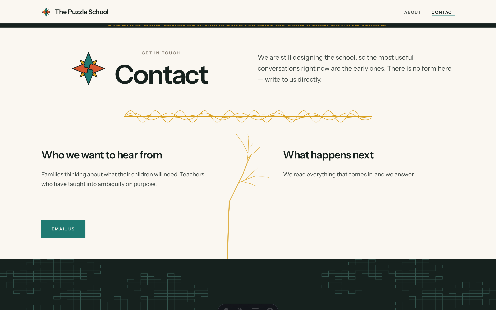
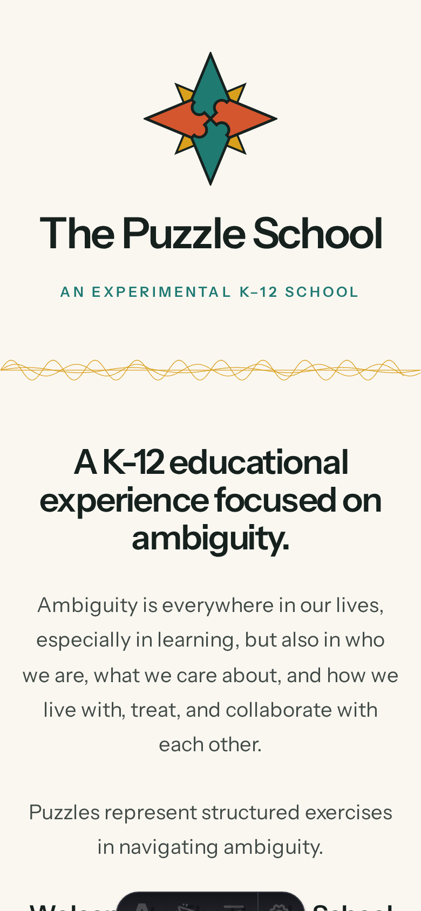
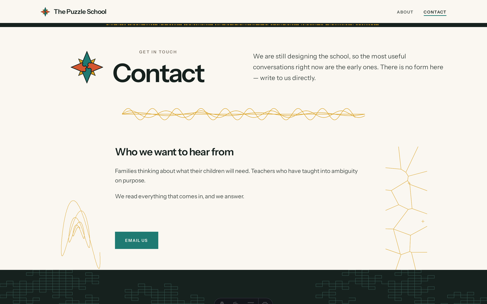
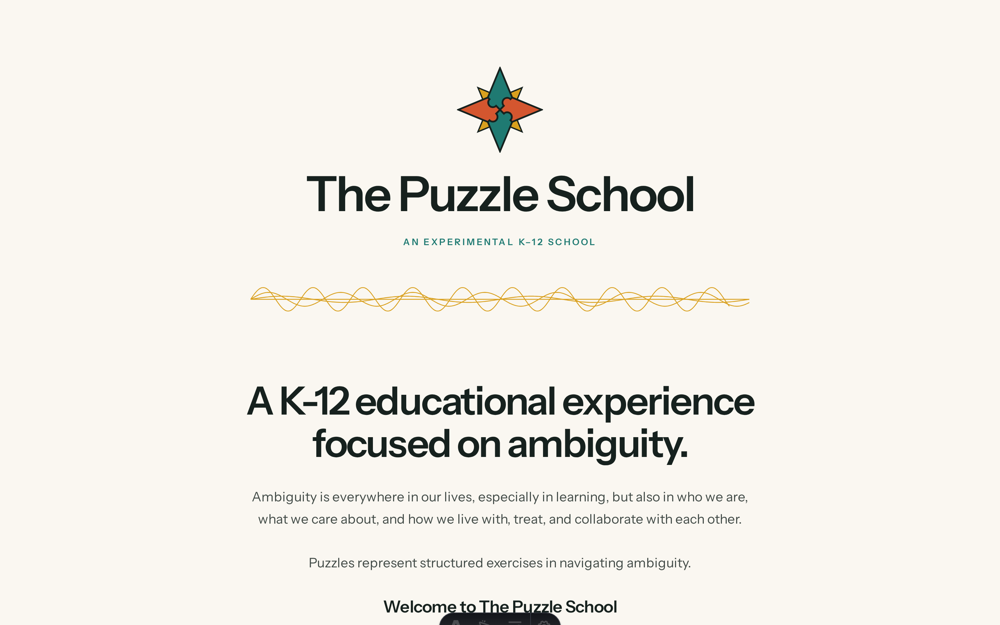
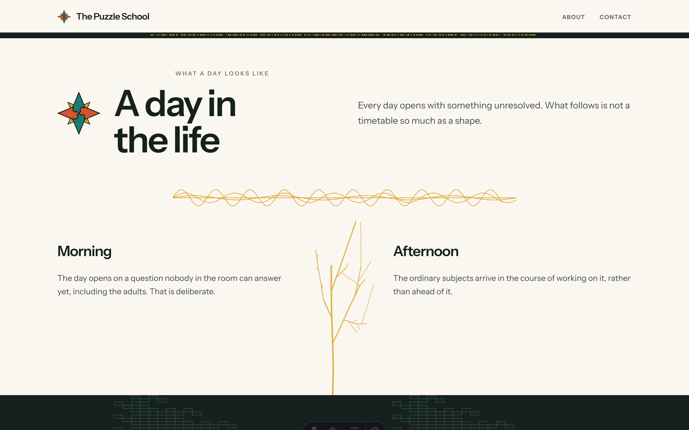
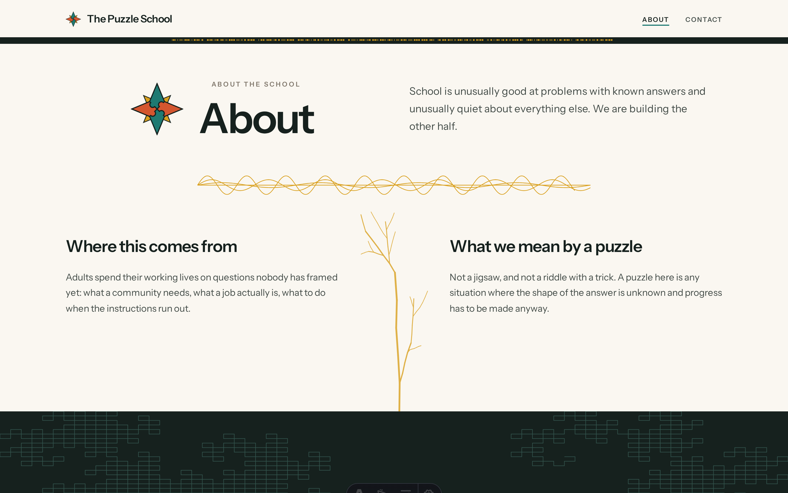
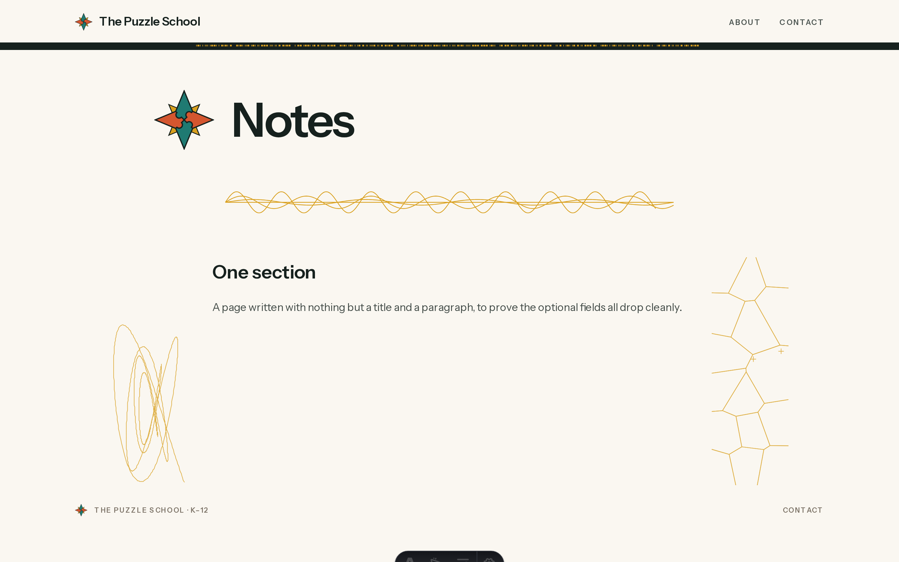

# The Puzzle School

The marketing site for The Puzzle School — an experimental K–12 school whose
subject is ambiguity: how to notice it, stay with it, and move through it.

A static [Astro](https://astro.build) site, hosted on GitHub Pages at
**puzzleschool.org**, with content managed through
[`@codeyam/cms`](https://www.npmjs.com/package/@codeyam/cms) — a Git-backed CMS
that commits markdown straight to this repo. There is no server and no database.

## Getting started

```bash
git clone https://github.com/jaredcosulich/puzzleschool.git
cd puzzleschool
npm run setup     # installs dependencies
npm run dev       # http://127.0.0.1:4321
```

Requires Node 20 or newer.

## Editing the site

Every page — including the home page — is a markdown entry in
`src/content/pages/`. Open **`/admin`** on the running site to edit them, or edit
the markdown directly.

Creating a page in `/admin` publishes it with no code change: `[...slug].astro`
emits a route for every published entry, so a new markdown file becomes a live
page. `src/data/settings.json` and `src/data/nav.json` hold the site title,
contact address, footer line, and menu. The menu does double duty: the footer's
Contact link resolves out of `nav.json`, so moving or renaming the Contact entry
there moves the footer link with it.

## The line structures

The design's distinguishing device is a set of hairline figures generated by
mathematical rules — a Fibonacci square spiral, a sine field, a Koch fragment, a
dragon curve, a branching tree, a morse rule. Every one is **deliberately left
incomplete**: a limb ends bare, a curve stops before it closes.

They live in `src/lib/structures.ts` as pure functions, generated from their
rules rather than pasted as path data, so the incompleteness stays a parameter
(`fraction`, `openLast`, `bareLimb`, `stopChance`) rather than something frozen
into an export. Their irregularity comes from a *seeded* generator, so the
figures are organic to look at but identical on every build.

The branching tree goes one step further and varies on two axes, because a
single frozen specimen repeated down every page undercut the idea of something
grown:

- **Per page**, at build time. The seed is hashed from the page slug, so About,
  Contact and a page an editor writes next year each grow their own tree with no
  code change — and the same tree on every build, which is what keeps the
  committed screenshots from churning.
- **Per visit**, in the browser. A small script regrows each tree from a fresh
  random seed after load, so no two visits see quite the same figure. The
  server-rendered tree has to be valid on its own: it is what a no-JS visitor
  keeps, and what everyone sees before the script runs.

The variation is bounded by `TREE_ENVELOPE` so every tree stays recognisably the
same species. That envelope is enforced twice — parameters are *sampled* from
declared ranges, and the grown result is then *checked* (branch count, segment
count, proportion, canopy spread, balance, and whether the bare limb actually
landed) with a bounded resample when it fails. Both halves are needed: a draw
from inside the ranges can still come out a bald stick.

Append **`?tree=static`** to any URL to suppress the per-visit regrow and keep
the build-time tree. Every registered scenario URL carries it — without it a
screenshot would differ on every capture.

## Project shape

```
src/
  content/pages/    one markdown file per page — the home page included
  data/             editable site settings and navigation
  lib/structures.ts the rule-generated line figures (+ their unit tests)
  components/       the design, split by where it appears
  pages/            routes: index, [...slug] catch-all, isolation harness
```

## Deploying

The site builds to `dist/` and deploys to GitHub Pages from
`.github/workflows/deploy.yml`. `public/CNAME` holds the custom domain, so it
has to stay in `public/` — a CNAME at the repo root never reaches the build
output.

- **[CMS_SETUP.md](./CMS_SETUP.md)** — the three ways an editor signs in to
  `/admin` (paste-a-token, the OAuth worker popup, or the local Decap backend).
- **[DEPLOY_SETUP.md](./DEPLOY_SETUP.md)** — deploying the static site and the
  optional auth worker.

## Commands

```bash
npm run dev      # dev server
npm run build    # type-check + static build into dist/
npm run test     # unit tests (vitest)
npm run check    # astro check only
```

<!-- codeyam:run-and-edit:start -->
## Develop this project with codeyam-editor

This project is built with [codeyam-editor](https://codeyam.com) — code and runnable data scenarios are authored side by side against a live preview.

```bash
# Clone the repo
git clone https://github.com/jaredcosulich/puzzleschool && cd puzzleschool

# Install codeyam-editor
npm install -g @codeyam-editor/codeyam-editor@latest

# Launch the editor (split-screen terminal + live preview)
codeyam-editor start
```
<!-- codeyam:run-and-edit:end -->

<!-- codeyam:scenario-gallery:start -->
## Scenario gallery

States captured as runnable scenarios with codeyam-editor:

### About - Footer Contact Link Followed



### Home - Narrow Viewport



### Contact - Email Only



### Home - Full Design



### Page - Created From The CMS



### About - Full Design



### Page - Minimal Fields


<!-- codeyam:scenario-gallery:end -->
